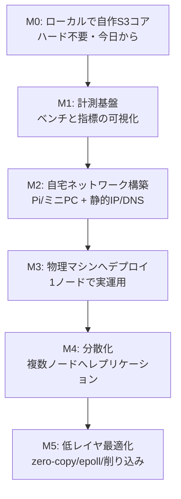

# homelab-cloud — PLAN

> 自宅の物理マシン上に「AWS の礎になっている古典技術」を自作し、
> 制約下でパフォーマンスを計測しながら削り込むプロジェクト。
> m5stack のフレーム描画改善で得た「低レイヤ × 制約 × 計測 × 物理」の体験を、
> 分散システム / インフラの領域で再現するのが目的。

## なぜこの題材か（体験の再現条件）

m5stack で面白かった4条件を、インフラ領域で満たす:

| 条件 | m5stack | homelab-cloud |
|------|---------|---------------|
| 抽象の底が抜けている | フレームバッファ/DMA/SPI | HTTP/追記ログ/ファイルI/O/epoll |
| 制約が明確 | CPU/RAM/帯域が有限 | 安いハード(Pi/ミニPC)が有限 |
| 数字で殴れる | FPS | req/s・p50/p99 レイテンシ・スループット |
| 物理に触れている | 目の前の画面 | 自宅ラック/自作LAN |

## 全体ロードマップ（山の登山道）

大きく「小さく動く → 物理へ広げる → 削る」の順で進める。

### マイルストーン詳細

- **M0 自作S3コア（ハード不要）**: 追記ログ(WAL)への `PUT`、index からの `GET`、`DELETE`（tombstone）。
  ローカルで動く最小オブジェクトストレージ。ハード調達を待たずに始められる入口。
- **M1 計測基盤**: PUT/GET のスループットと p50/p99 を測るベンチ。ここが「FPS カウンタ」に相当する。
- **M2 自宅ネットワーク**: Raspberry Pi 5 ×2〜3 + スイッチ。静的IP・DNS・疎通。物理の入口。
- **M3 物理デプロイ**: M0 の自作S3を実ハード1台に載せ、LAN 経由で `PUT`/`GET`。
- **M4 分散化**: 複数ノードへレプリケーション。整合性/耐障害の古典問題に触れる。
- **M5 削り込み**: 計測を見ながら zero-copy・epoll・log compaction 等で削る。ここが本丸。

## 制約と指標（先に決めておく）

- **制約**: まずは1台のハード性能を上限とみなす（富豪的に殴らない）。
- **主指標**: `PUT`/`GET` の req/s、p50/p99 レイテンシ、ディスクスループット。
- **副指標**: メモリ使用量、log compaction のコスト、ノード障害時の復旧時間。

## 開発サイクル（~/git/CLAUDE.md 準拠）

各マイルストーンは `Issue 起票 → 実装 → reviewer レビュー → PR → マージ`。
研究は `research/`、完了概要は `summary/`、詰まった点の解説は `knowledge/` に残す。

## 技術選定（M0 の初期案 / research 参照）

- 言語: 未定（Go か Rust が有力。理由は research/01 参照）
- ストレージ: 追記ログ(WAL) + 埋め込みインデックス(sqlite など)
- API: S3 互換の最小サブセット（`PUT`/`GET`/`DELETE` + bucket）

## 未決事項（次サイクルで詰める）

- [ ] 実装言語の確定（Go / Rust / その他）
- [ ] ハード構成の確定（Pi 5 何台 / ミニPC 併用か）
- [ ] M0 のスコープ確定 → Issue 化
