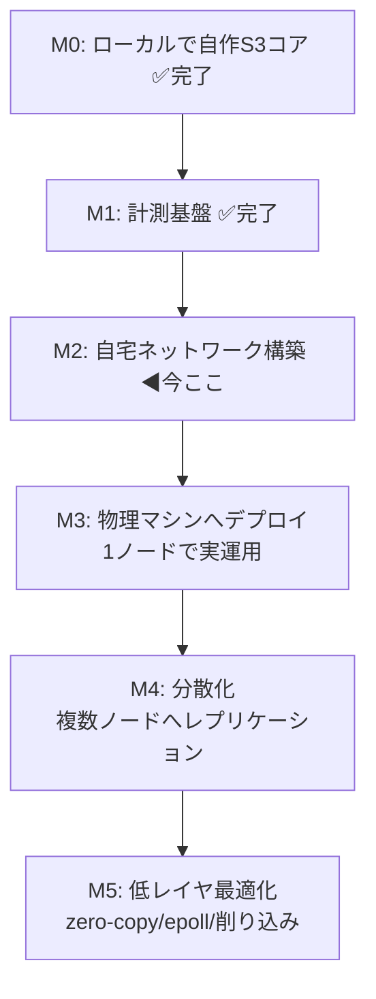

# homelab-cloud — PLAN

> 自宅の物理マシン上に「AWS の礎になっている古典技術」を自作し、
> 制約下でパフォーマンスを計測しながら削り込むプロジェクト。
> m5stack のフレーム描画改善で得た「低レイヤ × 制約 × 計測 × 物理」の体験を、
> 分散システム / インフラの領域で再現するのが目的。

## なぜこの題材か（体験の再現条件）

m5stack で面白かった4条件を、インフラ領域で満たす:

| 条件 | m5stack | homelab-cloud |
|------|---------|---------------|
| 抽象の底が抜けている | フレームバッファ/DMA/SPI | HTTP/追記ログ/ファイルI/O/epoll |
| 制約が明確 | CPU/RAM/帯域が有限 | 安いハード(Pi/ミニPC)が有限 |
| 数字で殴れる | FPS | req/s・p50/p99 レイテンシ・スループット |
| 物理に触れている | 目の前の画面 | 自宅ラック/自作LAN |

## 全体ロードマップ（山の登山道）

大きく「小さく動く → 物理へ広げる → 削る」の順で進める。

### マイルストーン詳細

- **M0 自作S3コア（ハード不要）**: 追記ログ(WAL)への `PUT`、index からの `GET`、`DELETE`（tombstone）。
  ローカルで動く最小オブジェクトストレージ。ハード調達を待たずに始められる入口。
- **M1 計測基盤**: PUT/GET のスループットと p50/p99 を測るベンチ。ここが「FPS カウンタ」に相当する。
- **M2 自宅ネットワーク**: Raspberry Pi 5 を**まず1台**（M3で実運用）→ M4で2台目 + スイッチ。静的IP・DNS・疎通。物理の入口。
- **M3 物理デプロイ**: M0 の自作S3を実ハード1台に載せ、LAN 経由で `PUT`/`GET`。
- **M4 分散化**: 複数ノードへレプリケーション。整合性/耐障害の古典問題に触れる。
- **M5 削り込み**: 計測を見ながら zero-copy・epoll・log compaction 等で削る。ここが本丸。

## 制約と指標（先に決めておく）

- **制約**: まずは1台のハード性能を上限とみなす（富豪的に殴らない）。
- **主指標**: `PUT`/`GET` の req/s、p50/p99 レイテンシ、ディスクスループット。
- **副指標**: メモリ使用量、log compaction のコスト、ノード障害時の復旧時間。

## 開発サイクル（~/git/CLAUDE.md 準拠）

各マイルストーンは `Issue 起票 → 実装 → reviewer レビュー → PR → マージ`。
研究は `research/`、完了概要は `summary/`、詰まった点の解説は `knowledge/` に残す。

## 技術選定（確定分）

- 言語: **Rust に確定**（M0/M1 で実績。依存クレートゼロで実装中）
- ストレージ: 追記ログ(WAL) + インメモリ index（Bitcask 型）。M0 で実装済み。
- 計測: 依存ゼロの自作ベンチ（criterion 不採用）。M1 で実装済み。
- API: S3 互換の最小サブセット（`PUT`/`GET`/`DELETE` + bucket）— まだ HTTP 化していない（M3 で LAN 経由アクセス時に検討）

## 未決事項

- [x] 実装言語の確定 → **Rust**
- [x] M0 のスコープ確定 → Issue 化（#1 / PR #2）
- [x] ハード構成の確定 → **Raspberry Pi 5 8GB / NVMe ブート / まず1台 → M4 で2台**（`research/02-hardware.md`）。ミニPCは対抗馬どまり
- [x] HTTP/S3 API 化のタイミング → **ハード着荷を待たずソフト先行で実装済み**（#14 / PR #15）。`src/http.rs` + `src/bin/server.rs`
- [ ] 発注構成の最終確定（NVMe 容量 256 or 512GB / RAM 8 or 16GB は 2026 値上げ幅を見て判断）
- [ ] 自宅サブネット/GW の実値確認（`research/03` は `192.168.10.0/24` を仮採番）

## 現在地（次セッションの開始点）

**完了済み**: M0（自作S3コア, #1/#2）、M1（計測基盤, #6/#7）。概要は `summary/01-m0.md` / `summary/02-m1.md`。
**M2 の机上調査は完了**: `research/02-hardware.md`（買うハード確定）/ `research/03-os-network.md`（OS・IP・名前解決・疎通設計）。
**M3 のソフト先行分（HTTP 化）完了**: 自作S3コアを HTTP/S3 最小サブセット（PUT/GET/DELETE）で叩ける常駐サーバを実装（#14 / PR #15）。依存ゼロ自作 HTTP、1接続1スレッド + `Mutex<ObjectStore>`。reviewer 指摘（ヘッダ上限・IO タイムアウト・poison 回復・smuggling/traversal 防御）解消済み。
**ベンチの HTTP 経由対応 完了**: `S3Client`（`src/client.rs`）を追加し、`bench --url HOST:PORT` で起動済み server 越しに PUT/GET を計測（#17 / PR #18）。localhost 実測で local 直叩き（PUT ~484k/GET ~620k req/s）と HTTP 経由（PUT ~1.7k/GET ~2.4k req/s）の 100 倍超の差 = 接続毎往復コストが数字に出ることを確認。
現状 `main` は clean。実装は `src/lib.rs`（ObjectStore）、`src/metrics.rs`、`src/http.rs`（HTTP ワイヤ形式・双方向）、`src/client.rs`（S3Client）、`src/bin/server.rs`（常駐サーバ）、`src/bin/bench.rs`（local/HTTP 両対応ベンチ）。
起動: `cargo run --bin server -- [DATA_DIR] [BIND_ADDR]`（既定 `./data` / `127.0.0.1:8080`）。
計測: `cargo run --release --bin bench -- [--url HOST:PORT] [--ops N] [--value-size B]`（`--url` 省略で local 直叩き）。

**M2「自宅ネットワーク構築」の確定事項（research 02/03）**:

- ハード: **Raspberry Pi 5 8GB + 公式27W電源 + アクティブクーラー + M.2 HAT & NVMe SSD**（1台 約25,000〜28,000円）。
  購入先はスイッチサイエンス / KSY。**まず1台フル装備**で M3 まで完結、M4 着手時に同一構成を2台目 + ギガスイッチ追加。
- OS: **Raspberry Pi OS Lite 64-bit** を Imager 詳細設定で焼き込み（SSH公開鍵/hostname 事前投入のヘッドレス）→ **NVMe ブート**へ移行。
- ネットワーク: **ルータ DHCP 予約**で固定IP（`hlc-node1=.11`）、名前解決は **mDNS(`.local`) + `/etc/hosts` 併記**。
- M2 完了条件は `research/03` の「疎通確認チェックリスト」を満たすこと。

**次の一歩 = 実機発注 → M3「物理デプロイ」の物理部分**（ソフトの HTTP 化は完了済み）:

1. 発注構成の最終確定（未決事項の NVMe 容量 / RAM）→ スイッチサイエンス or KSY で発注。**※現実アクションなのでユーザーが実施**。
2. 着荷後、`research/03` の手順で OS 導入・NVMe ブート・疎通確認（M2 の物理部分をクローズ）。
3. M3: `hlc-node1` に Rust ツールチェーン → 本リポジトリをビルド → `cargo run --bin server -- <data_dir> 0.0.0.0:8080` で常駐 → LAN 越し `PUT`/`GET`/`DELETE`。
   **開発機から `bench --url <node-ip>:8080`** を回し、localhost 計測との差（LAN 往復・NVMe 実I/O）を取り直す（HTTP 経由ベンチは実装済み）。
   - 次のソフト課題候補（着荷を待たず着手可）: `fsync` 耐久性（PUT の耐久性 on/off を数字で比較）/ log compaction（M5 の入口）/ ベンチの並行リクエスト対応（p99 を負荷下で見る）。

**再開時の運用**: 文脈はこの PLAN.md と `research/02`・`03` / `summary/` に残っている前提で、新しいセッションを切って始める。
着手前にアプローチを提案し、Issue 先行（起票 → ブランチ実装 → reviewer レビュー → PR → マージ、main 直 push 不可）で進める。
