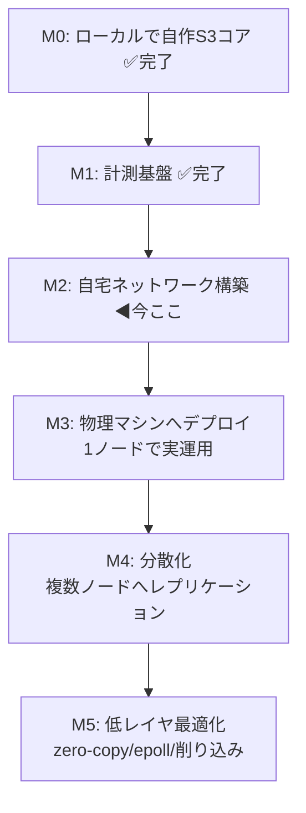

# homelab-cloud — PLAN

> 自宅の物理マシン上に「AWS の礎になっている古典技術」を自作し、
> 制約下でパフォーマンスを計測しながら削り込むプロジェクト。
> m5stack のフレーム描画改善で得た「低レイヤ × 制約 × 計測 × 物理」の体験を、
> 分散システム / インフラの領域で再現するのが目的。

## なぜこの題材か（体験の再現条件）

m5stack で面白かった4条件を、インフラ領域で満たす:

| 条件 | m5stack | homelab-cloud |
|------|---------|---------------|
| 抽象の底が抜けている | フレームバッファ/DMA/SPI | HTTP/追記ログ/ファイルI/O/epoll |
| 制約が明確 | CPU/RAM/帯域が有限 | 安いハード(Pi/ミニPC)が有限 |
| 数字で殴れる | FPS | req/s・p50/p99 レイテンシ・スループット |
| 物理に触れている | 目の前の画面 | 自宅ラック/自作LAN |

## 全体ロードマップ（山の登山道）

大きく「小さく動く → 物理へ広げる → 削る」の順で進める。

### マイルストーン詳細

- **M0 自作S3コア（ハード不要）**: 追記ログ(WAL)への `PUT`、index からの `GET`、`DELETE`（tombstone）。
  ローカルで動く最小オブジェクトストレージ。ハード調達を待たずに始められる入口。
- **M1 計測基盤**: PUT/GET のスループットと p50/p99 を測るベンチ。ここが「FPS カウンタ」に相当する。
- **M2 自宅ネットワーク**: Raspberry Pi 5 ×2〜3 + スイッチ。静的IP・DNS・疎通。物理の入口。
- **M3 物理デプロイ**: M0 の自作S3を実ハード1台に載せ、LAN 経由で `PUT`/`GET`。
- **M4 分散化**: 複数ノードへレプリケーション。整合性/耐障害の古典問題に触れる。
- **M5 削り込み**: 計測を見ながら zero-copy・epoll・log compaction 等で削る。ここが本丸。

## 制約と指標（先に決めておく）

- **制約**: まずは1台のハード性能を上限とみなす（富豪的に殴らない）。
- **主指標**: `PUT`/`GET` の req/s、p50/p99 レイテンシ、ディスクスループット。
- **副指標**: メモリ使用量、log compaction のコスト、ノード障害時の復旧時間。

## 開発サイクル（~/git/CLAUDE.md 準拠）

各マイルストーンは `Issue 起票 → 実装 → reviewer レビュー → PR → マージ`。
研究は `research/`、完了概要は `summary/`、詰まった点の解説は `knowledge/` に残す。

## 技術選定（確定分）

- 言語: **Rust に確定**（M0/M1 で実績。依存クレートゼロで実装中）
- ストレージ: 追記ログ(WAL) + インメモリ index（Bitcask 型）。M0 で実装済み。
- 計測: 依存ゼロの自作ベンチ（criterion 不採用）。M1 で実装済み。
- API: S3 互換の最小サブセット（`PUT`/`GET`/`DELETE` + bucket）— まだ HTTP 化していない（M3 で LAN 経由アクセス時に検討）

## 未決事項

- [x] 実装言語の確定 → **Rust**
- [x] M0 のスコープ確定 → Issue 化（#1 / PR #2）
- [ ] ハード構成の確定（Pi 5 何台 / ミニPC 併用か）← M2 で詰める
- [ ] HTTP/S3 API 化のタイミング（M3 の LAN アクセスと合わせるか）

## 現在地（次セッションの開始点）

**完了済み**: M0（自作S3コア, #1/#2）、M1（計測基盤, #6/#7）。概要は `summary/01-m0.md` / `summary/02-m1.md`。
現状 `main` は clean。実装は `src/lib.rs`（ObjectStore）、`src/metrics.rs`、`src/bin/bench.rs`。

**次の一歩 = M2「自宅ネットワーク構築」**。ソフトから物理へ移る節目。M2 の候補タスク:

1. まず `research/` に「M2 で何を作るか」を調査してまとめる（~/git/CLAUDE.md の「新規着手前に research」に従う）。
   - Raspberry Pi 5 の台数（まず1台で M3 デプロイ → 2台で M4 分散、が最小手順）
   - 静的IP / DNS の方式（ルータの DHCP 予約 vs 各ノード固定、ローカル名前解決を何で行うか）
   - OS/セットアップ手順（Pi OS Lite、SSH 有効化、ヘッドレス運用）
2. ハード未着荷でも進められる部分（構成図・IP 設計・手順書）を先に `research/` へ。
3. 実機が揃ったら疎通確認 → M3 で M0 の自作S3を1台に載せ、M1 のベンチを **LAN 越し**に回して数字を取り直す。

**再開時の運用**: 文脈はこの PLAN.md と `summary/` に残っている前提で、新しいセッションを切って始める。
着手前にアプローチを提案し、Issue 先行（起票 → ブランチ実装 → reviewer レビュー → PR → マージ、main 直 push 不可）で進める。
