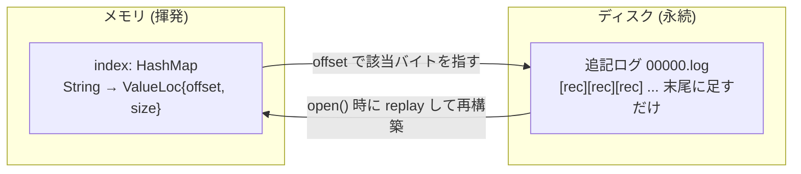
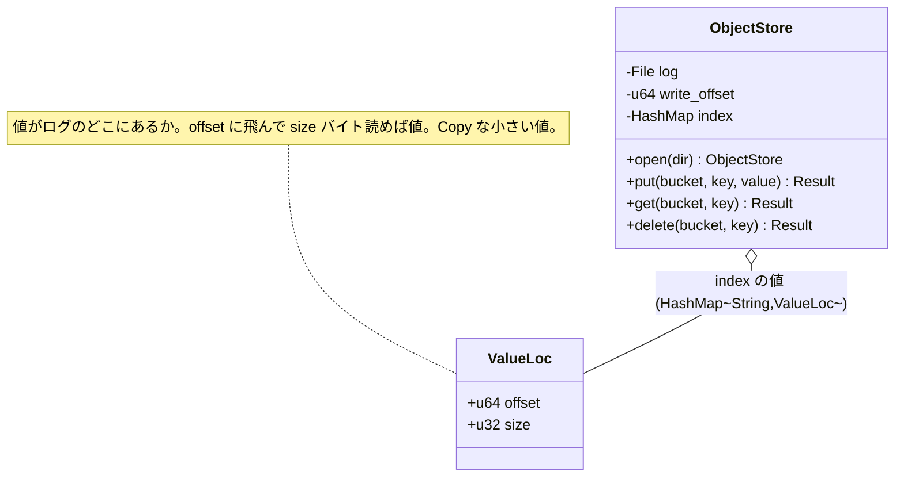
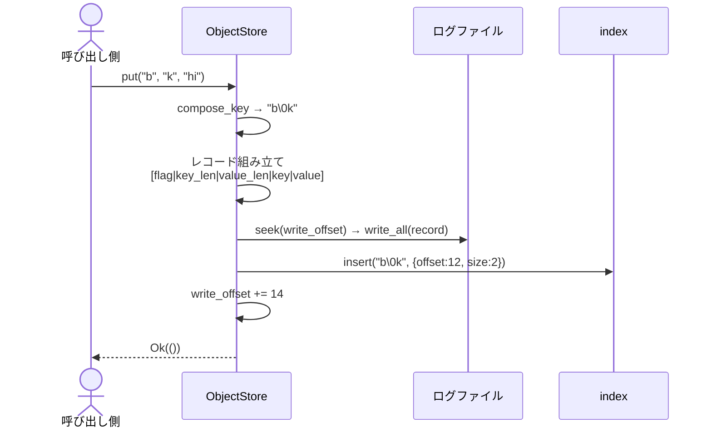
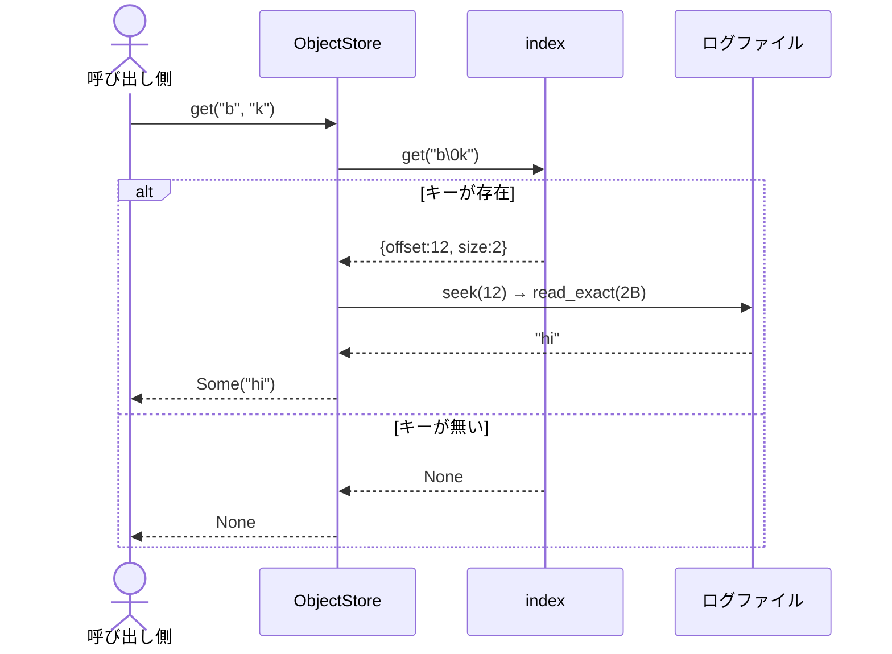
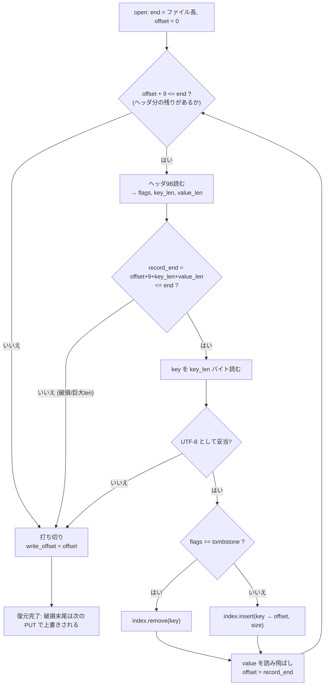

# knowledge/02 — M0 アーキテクチャ図（UML / mermaid）

M0（`src/lib.rs`）の構造を図で押さえる。文章版は [`01-m0-qa.md`](./01-m0-qa.md)。
GitHub 上ではこの mermaid はそのまま図として描画される。

---

## 1. 全体像：メモリの index がディスクのログを指す

芯の不変条件は「**index は常にログ上の最新値の位置を指す**」。それを1枚にした図。

- 書き込みは**必ずログ末尾に append**（シーケンシャルで速い）。
- 読み取りは index で位置を引いて**1回 seek して読む**だけ。
- 再起動時はログを頭から `replay` して index を作り直す（メモリは揮発するから）。

---

## 2. クラス図：登場人物

補助の自由関数（クラスではなく関数）:

- `replay_log(log)` — `open()` が使用。ログを頭から走査して `(index, write_offset)` を復元する。
- `compose_key(bucket, key)` — `put/get/delete` が使用。bucket と key を `\0` 区切りで連結する。

---

## 3. ログの1レコードのバイト構造

`put("b", "k", "hi")` が書くレコード（キーは compose_key で `b\0k` = 3バイト）。

| offset | 0 | 1–4 | 5–8 | 9–11 | 12–13 |
|--------|---|-----|-----|------|-------|
| 意味 | flags | key_len | value_len | key | value |
| サイズ | 1B | 4B (LE) | 4B (LE) | 3B | 2B |
| 中身(16進) | `00` | `03 00 00 00` | `02 00 00 00` | `62 00 6B` | `68 69` |
| 中身(意味) | 通常 | 3 | 2 | `b \0 k` | `h i` |

合計14バイト。ポイント:

- ヘッダは `flags + key_len + value_len = 9バイト固定`。
- 値の開始位置 = `レコード開始 + 9 + key_len` = `0 + 9 + 3 = 12`。
- よって index には `"b\0k" → {offset: 12, size: 2}` が入る。

---

## 4. シーケンス図：PUT

## 5. シーケンス図：GET

---

## 6. フローチャート：replay（再起動時の index 復元 + 破損末尾の打ち切り）

reviewer の 🔴 must で入れた「入力を信用しない」検証がここ。

- `record_end > end` の判定が、**巨大 len による OOM** と **範囲外レコードの登録**を同時に防ぐ。
- 打ち切った `offset` が次の書き込み開始位置になるので、ゴミは自然に上書き修復される。
